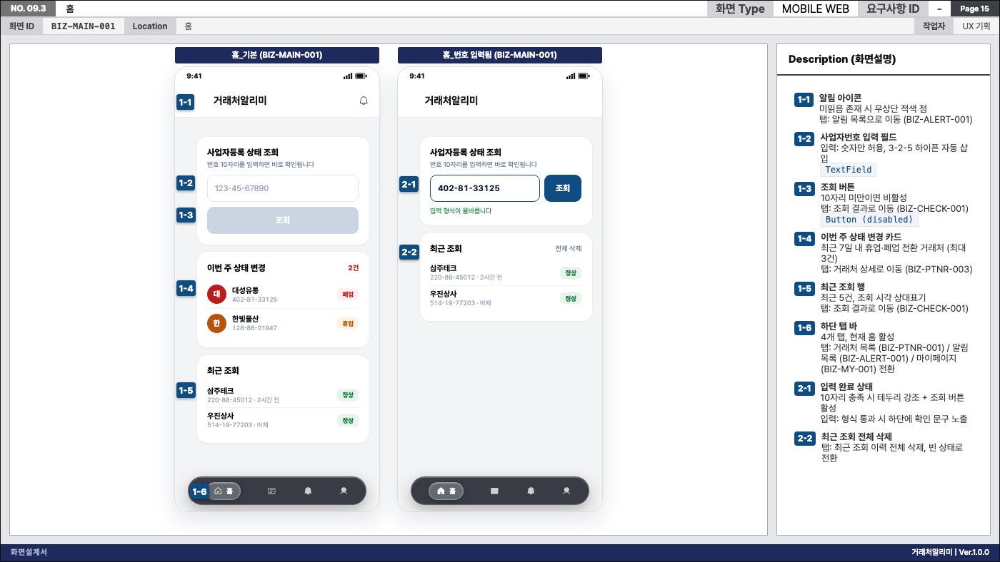
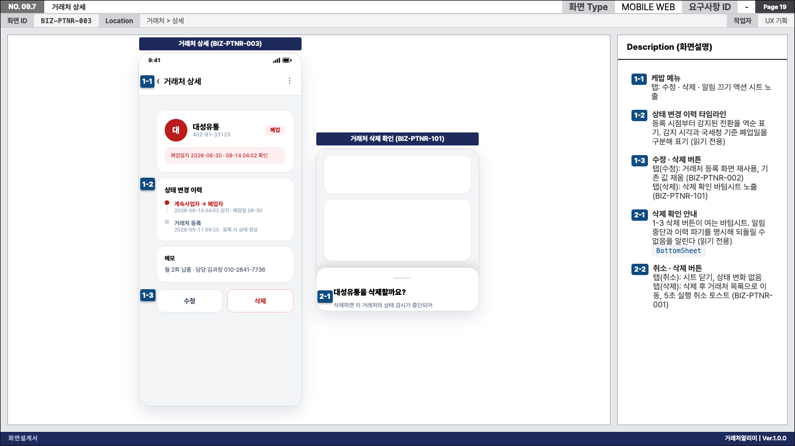
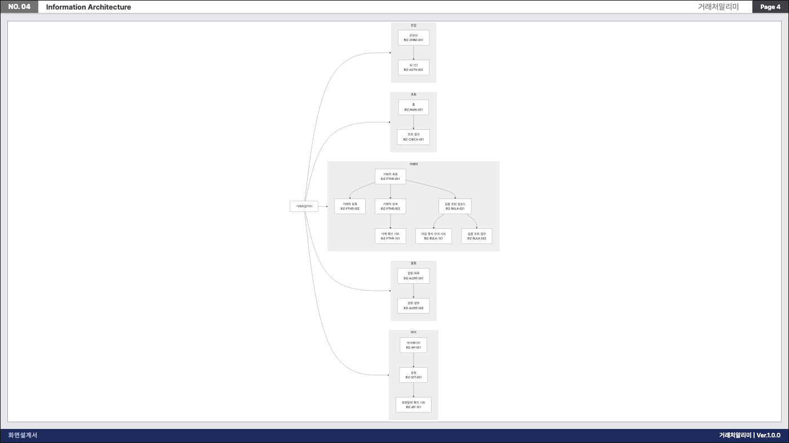
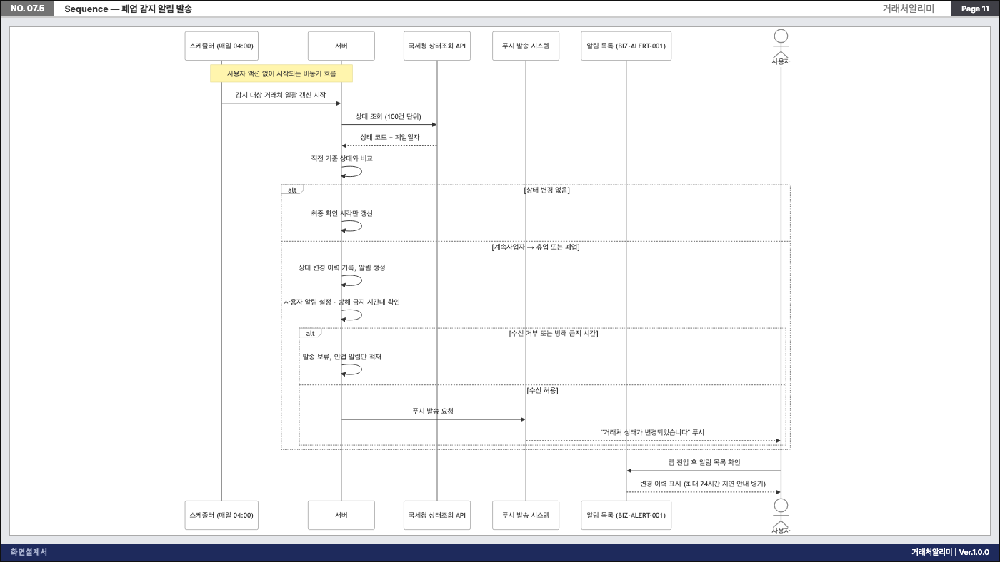

# doksam-skills

Claude Code, Codex, Antigravity 에서 쓰는 Agent Skill 모음입니다. `install.sh` 가 `skills/` 아래 모든 스킬을 세 런타임 경로에 노출합니다.



_한 줄 요청으로 나온 화면설계서의 한 장. 왼쪽은 목업, 오른쪽은 화면설명이고 번호 배지가 서로 1:1 로 대응합니다. [더 보기](#산출물-미리보기)_

## 스킬

스킬은 17개입니다. 요청 문장이 스킬 설명과 맞으면 런타임이 알아서 고릅니다. 이름을 직접 부를 필요는 없습니다. `yd-` 로 시작하는 스킬은 저장소 소유자가 직접 만든 것입니다. 외부에서 가져온 스킬은 원래 이름을 씁니다.

`에이전트` 열은 그 스킬을 이름 있는 에이전트로도 부를 수 있는지 보여줍니다. 터미널에서는 `./install.sh --list` 로 같은 내용과 세 런타임 등록 상태를 함께 봅니다.

### 기획에서 구현까지

| 스킬 | 에이전트 (Claude / Codex) | 언제 쓰나 |
|---|---|---|
| [yd-sdlc-orchestrator](skills/yd-sdlc-orchestrator/SKILL.md) | `yd-sdlc-orchestrator` / `yd_sdlc_orchestrator` | 한 줄 요청으로 서비스 전체를 만들 때. 기획 → 구현 → 보안 → 로컬 기동을 차례로 맡기고 단계마다 게이트를 확인합니다 |
| [yd-mobile-web-planner](skills/yd-mobile-web-planner/SKILL.md) | `yd-mobile-web-planner` / `yd_mobile_web_planner` | 모바일 웹·앱의 IA 와 화면설계서(HTML 슬라이드)와 Business Rules 를 만들 때 |
| [yd-nextjs-implementer](skills/yd-nextjs-implementer/SKILL.md) | `yd-nextjs-implementer` / `yd_nextjs_implementer` | 화면설계서를 코드로 옮길 때. 프론트는 Next.js 또는 Vite + React 중에서 고릅니다 |
| [yd-finguard](skills/yd-finguard/SKILL.md) | `yd-finguard` / `yd_finguard` | FinGuard CLI 로 취약점을 점검하고, 심각도 기준으로 통과 여부를 가를 때 |

### UI 와 기술 스택

| 스킬 | 에이전트 (Claude / Codex) | 언제 쓰나 |
|---|---|---|
| [yd-doksam-ui](skills/yd-doksam-ui/SKILL.md) | `yd-doksam-ui` / `yd_doksam_ui` | doksam 프로젝트 UI 를 ui.doksam.com 표준(토큰·컴포넌트·규칙)에 맞출 때. 표준 카탈로그 자체를 넓힐 때도 씁니다 |
| [yd-frontend-build](skills/yd-frontend-build/SKILL.md) | `yd-frontend-build` / `yd_frontend_build` | pnpm·Vite 빌드, 의존성, 번들 크기, 폐쇄망 self-host 를 다룰 때 |
| [yd-react-expert](skills/yd-react-expert/SKILL.md) | `yd-react-expert` / `yd_react_expert` | React 19 컴포넌트·상태·effect·접근성·렌더 성능을 다룰 때 |
| [yd-go-expert](skills/yd-go-expert/SKILL.md) | `yd-go-expert` / `yd_go_expert` | Go 1.22+ 코드를 쓰거나 리뷰할 때 (에러·동시성·`net/http`·`go:embed`) |
| [yd-sqlite-expert](skills/yd-sqlite-expert/SKILL.md) | `yd-sqlite-expert` / `yd_sqlite_expert` | SQLite 고유 문제를 다룰 때 (읽기 전용 조회·WAL·잠금·동적 테이블명) |
| [yd-db-expert](skills/yd-db-expert/SKILL.md) | `yd-db-expert` / `yd_db_expert` | 스키마 설계, 인덱스·쿼리 튜닝, PostgreSQL 운영을 다룰 때 |

### 에이전트 작업 관리

| 스킬 | 에이전트 (Claude / Codex) | 언제 쓰나 |
|---|---|---|
| [yd-handoff](skills/yd-handoff/SKILL.md) | 없음 | 세션을 끊고 다음 세션에 넘길 때. 트래커가 있으면 본문은 이슈에, `HANDOFF.md` 에는 URL 만 둡니다 |
| [yd-agents-yaml](skills/yd-agents-yaml/SKILL.md) | 없음 | 저장소에 `AGENTS.md` + `AGENTS.yaml` + 검증기를 세팅하거나 고칠 때 |
| [yd-agents-mem](skills/yd-agents-mem/SKILL.md) | 없음 | 전역 지침·메모리·설정을 고친 뒤 agents-mem 레포에 백업할 때. 다른 호스트 변경을 받거나 새 머신을 복원할 때도 씁니다 |
| [yd-skill-evolve](skills/yd-skill-evolve/SKILL.md) | `yd-skill-evolve` / `yd_skill_evolve` | 피드백이나 반복된 실수를 이 저장소 스킬의 `SKILL.md` 에 반영할 때 |
| [yd-memory-factcheck](skills/yd-memory-factcheck/SKILL.md) | `yd-memory-factcheck` / `yd_memory_factcheck` | 에이전트 메모리를 코드·DB·이슈와 대조해 낡은 기억을 고칠 때 |
| [yd-session-recording](skills/yd-session-recording/SKILL.md) | 없음 | 강의·회의를 실시간 전사하고 10분마다 요약할 때. "녹음시작" 으로 시작합니다 |

### 글쓰기

| 스킬 | 에이전트 (Claude / Codex) | 언제 쓰나 |
|---|---|---|
| [yd-writer-kr](skills/yd-writer-kr/SKILL.md) | `yd-writer-kr` / `yd_writer_kr` | 이슈·PR·문서·공지·보고서를 한국어로 쓰거나 고칠 때. 번역투와 군더더기를 빼고, 주장마다 근거를 붙입니다 |

## 에이전트

스킬 13개는 이름 있는 에이전트로도 부를 수 있습니다. 에이전트는 스킬을 그대로 쓰는 입구일 뿐입니다. 행동 규칙은 `SKILL.md` 한곳에만 있습니다. 설치는 `./install.sh --with-agent` 입니다.

| 런타임 | 에이전트 이름 | 예 |
|---|---|---|
| Claude Code | 스킬 이름 그대로 | `claude --agent yd-mobile-web-planner "..."` |
| Codex | `-` 를 `_` 로 바꾼 이름 | `yd_mobile_web_planner agent 를 사용해서 ...` |
| Antigravity | 스킬 이름 그대로 (`doksam-skills-agents` 플러그인) | `agy agents` 로 등록 확인 |

에이전트가 **없는** 스킬은 4개입니다. 빠뜨린 것이 아니라 일부러 두지 않았습니다.

| 스킬 | 에이전트를 두지 않는 이유 |
|---|---|
| yd-session-recording | 녹음 프로세스를 몇 시간 띄워 두고 대화 중에 "중간 요약"·"녹음종료" 를 받아야 합니다. 한 번 실행하고 끝나는 에이전트로는 유지할 수 없습니다 |
| yd-handoff | 지금 세션의 상태를 그 자리에서 남기는 절차입니다. 다른 에이전트에게 맡기면 넘길 상태를 모릅니다 |
| yd-agents-yaml | 작업 중인 저장소를 직접 조사해 쓰는 절차입니다. 대화 중에 바로 쓰는 편이 빠릅니다 |
| yd-agents-mem | 지금 세션의 홈 디렉터리를 대상으로 바로 실행하는 절차입니다. 무엇을 고쳤는지 아는 세션이 돌려야 커밋 제목을 제대로 씁니다 |

어댑터 파일은 각 스킬의 `agents/` 에 있습니다 (`claude.md`·`codex.toml`·`antigravity.md`·`openai.yaml`). 등록 여부는 파일이 아니라 `./install.sh --verify --with-agent` 로 확인합니다. 런타임은 형식이 틀린 어댑터를 오류 없이 무시하기 때문입니다.

## 완성도

스킬마다 검증 장치를 얼마나 갖췄는지 비교한 표입니다. 점수는 2026-10-01 에 매긴 100점 만점 상대값입니다. 나머지 칸은 2026-10-04 에 실측했습니다.

| 순위 | 스킬 | 점수 | SKILL.md | scripts | tests | references | 비고 |
|---|---|---|---|---|---|---|---|
| 1 | yd-mobile-web-planner | 92 | 506줄 | 7 | 190건 | 3 | 런타임 간 산출물 비교 fixture 포함 |
| 2 | yd-nextjs-implementer | 72 | 300줄 | 2 | 32건 | 3 | 추적표 검증기, 기동 확인 스크립트 |
| 3 | yd-doksam-ui | 70 | 276줄 | 1 | 54건 | 1 | 표준 준수 스캐너 |
| 4 | yd-finguard | 55 | 73줄 | 1 | 7건 | 1 | 보안 게이트 래퍼 |
| 5 | yd-frontend-build | 50 | 186줄 | 1 | 15건 | 0 | 번들 검사기 |
| 6 | yd-handoff | 45 | 414줄 | 0 | 0 | 0 | 문서만 있고 검증 없음 |
| 7 | yd-memory-factcheck | 40 | 149줄 | 0 | 0 | 0 | |
| 8 | yd-react-expert | 38 | 146줄 | 0 | 0 | 0 | |
| 9 | yd-sqlite-expert | 37 | 142줄 | 0 | 0 | 0 | |
| 10 | yd-session-recording | 36 | 142줄 | 0 | 0 | 0 | |
| 11 | yd-go-expert | 35 | 126줄 | 0 | 0 | 0 | |
| 12 | yd-db-expert | 35 | 126줄 | 0 | 0 | 0 | |
| 13 | yd-writer-kr | 33 | 147줄 | 0 | 0 | 1 | 금지 표현 목록 |
| 14 | yd-agents-yaml | 30 | 78줄 | 1 | 12건 | 0 | 검증기는 별도 CI job |
| 15 | yd-skill-evolve | 25 | 76줄 | 0 | 0 | 0 | |
| 16 | yd-sdlc-orchestrator | 22 | 67줄 | 0 | 0 | 0 | 게이트는 다른 스킬의 검증기를 부릅니다 |
| - | yd-agents-mem | - | 84줄 | 0 | 0 | 0 | 2026-10-04 추가, 미평가. 실행은 agents-mem 레포 스크립트 |

- 1~3위는 검증 스크립트와 테스트를 갖춘 단계입니다. 4~5위는 일부만 자동화했고, 6위 아래는 문서만 있습니다.
- 테스트는 stdlib `unittest` 만 씁니다. 전체는 `./scripts/run_tests.sh` 로 돌립니다. 스킬 하나만 볼 때는 스킬별로 실행합니다. `yd-doksam-ui` 와 `yd-nextjs-implementer` 가 같은 파일명(`tests/test_contract.py`)을 써서, 한 번에 discover 하면 모듈 이름이 겹칩니다.

  ```bash
  ./scripts/run_tests.sh
  python3 -m unittest discover -s skills/<skill>/tests -t skills/<skill>/tests -v
  ```

## 설치 (Install)

설치 경로는 두 가지입니다.

1. **전역 설치 (기본)** — `./install.sh` 가 홈 디렉터리의 세 런타임 경로에 **심링크**를 만듭니다. 이 리포에서 스킬을 고치면 즉시 반영됩니다.
2. **프로젝트 vendoring** — 팀/다른 머신과 공유하려고 프로젝트 리포에 사본을 커밋한 경우(`<프로젝트>/.agents/skills/`), 전역 재설치로는 갱신되지 않습니다. **`./install.sh --vendor <프로젝트dir>`** 로 파일 단위 갱신합니다 — 심링크가 아닌 복사라 다른 머신에서도 동작하고, 실행 후 `git status` 요약으로 커밋 대상이 바로 보입니다. `--dry-run`(예고만), `--check`(차이 유무를 종료코드로 — 훅에서 뒤처짐 감지용), `--skill <name>`(선택 갱신)을 지원하며, 사본에만 있는 파일은 보고만 하고 지우지 않습니다.

`--with-agent` 는 세 런타임에 각기 다른 방식으로 에이전트를 설치합니다 — Claude Code(`~/.claude/agents/` 심링크) · Codex(`~/.codex/agents/` 심링크) · **Antigravity(`agy plugin install` 로 `doksam-skills-agents` 플러그인 등록, `agy agents` 로 확인)**. Antigravity 는 설치 시점에 파일이 복사되므로 어댑터 수정 후에는 `./install.sh --with-agent` 를 다시 실행합니다. `agy` CLI 가 없으면 안내만 출력됩니다.

[skills.sh](https://www.skills.sh) 생태계의 `skills` CLI 로 바로 설치할 수 있습니다.

```bash
npx skills add leeyudok/doksam-skills
```

저장소를 클론해 두고 쓰려면 `install.sh` 를 씁니다. 이쪽은 기본이 심링크
설치라 저장소에서 `SKILL.md` 를 고치면 런타임에 즉시 반영되고, 이름 있는
Agent Adapter 설치(`--with-agent`)와 프로젝트 단위 설치(`--project`)를
지원합니다. 자세한 내용은 아래 [사용 방법](#사용-방법-how-to-use) 을 보세요.

```bash
git clone https://github.com/leeyudok/doksam-skills.git
cd doksam-skills
./install.sh
```

## 쉽게 사용

```text
1. 이 저장소를 클론
2. cd [클론폴더]
3. claude
4. 입력창에 "주식스윙자동매매 모바일웹 버전으로 50-100장 (너가 필요하다고 생각하는 만큼) 내외로 기획서 만들어
병렬로 멀티llm 사용해서 해 ./output/yyyymmdd-[요약].html"
5. 저장된 ./output/yyyymmdd-[요약].html 파일을 열어서 디자인을 확인
```

## 사용 방법 (How to Use)

1. 이 저장소를 클론합니다.
2. 설치 스크립트를 실행합니다. 기본은 심링크이므로, 이후 저장소에서 `SKILL.md` 를 수정하면 세 런타임에 즉시 반영됩니다.

   ```bash
   ./install.sh
   ```

   기본값은 세 런타임에 공통 Skill만 설치합니다. Claude Code와 Codex의
   이름 있는 Agent Adapter까지 설치하려면 다음 옵션을 사용합니다.

   ```bash
   ./install.sh --with-agent
   ```

   `skills/` 아래 **모든 스킬**이 아래 패턴의 경로에 설치됩니다
   (`<skill>` 은 스킬 디렉터리명, `<skill_>` 은 `-` 를 `_` 로 바꾼 이름).

   | 런타임 | 설치 경로 |
   | --- | --- |
   | Codex, Gemini CLI | `~/.agents/skills/<skill>` |
   | Claude Code | `~/.claude/skills/<skill>` |
   | Antigravity (`agy`) | `~/.gemini/config/skills/<skill>` |
   | Claude Code Agent (`--with-agent`) | `~/.claude/agents/<skill>.md` |
   | Codex Agent (`--with-agent`) | `~/.codex/agents/<skill_>.toml` |

   Agent Adapter 원본은 각 스킬이 소유합니다(`skills/<skill>/agents/`).
   `--with-agent` 는 `claude.md` · `codex.toml` 이 있는 스킬만 설치합니다.

   Google Antigravity 로컬 제품군은 설치된 공통 Skill을 Agent에 장착합니다.
   Gemini API Managed Agent 등록용 역할 정의 원본은
   `skills/<skill>/agents/antigravity.md` 에 있으며, 인증이 필요한 원격 등록은
   설치 스크립트가 자동 수행하지 않습니다.

   특정 프로젝트에만 넣으려면 `--project` 를 씁니다. Antigravity 의 프로젝트 경로(`.agents/`)는 Codex 와 같으므로 두 경로로 세 런타임을 모두 커버합니다.

   ```bash
   ./install.sh --project ~/work/my-service
   # -> ~/work/my-service/.claude/skills/yd-mobile-web-planner   (Claude Code)
   # -> ~/work/my-service/.agents/skills/yd-mobile-web-planner    (Codex, Antigravity)
   ```

   Antigravity 의 프로젝트 경로는 `.git` 이 있는 **저장소 루트** 기준으로 해석되므로, `--project` 에는 하위 디렉터리가 아니라 저장소 루트를 넘기세요.

   심링크 대신 복사하려면 `--copy`, 미리 확인만 하려면 `--dry-run`, 제거는 `--uninstall` 입니다. 전체 옵션은 `./install.sh --help` 를 참고하세요.

3. 에이전트에게 요청합니다.

   > *"새로운 반려동물 용품 쇼핑몰 모바일웹 기획해줘"*
   > *"동네 맛집 리뷰 커뮤니티 앱 화면 기획서 작성해볼래?"*

4. 에이전트가 스킬을 감지하고, 해당 도메인의 IA와 화면 설계서를 단일 HTML 파일로 저장해 줍니다.

### 이름 있는 Agent 호출

`--with-agent`로 설치했다면 Claude Code에서는 전용 Agent를 메인 세션으로
실행할 수 있습니다.

```bash
claude --agent yd-mobile-web-planner \
  "테니스 동호회 모바일 웹 화면설계서 만들어줘"
```

Codex에서는 custom agent 이름을 지정해 위임하도록 요청합니다.

```text
yd_mobile_web_planner agent를 사용해서 테니스 동호회 모바일 웹 화면설계서를 만들어줘
```

Antigravity 로컬 환경에서는 같은 요청이 `yd-mobile-web-planner` Skill을
자동 감지합니다. Managed Agent로 배포할 때는
`skills/yd-mobile-web-planner/agents/antigravity.md` 와 공통 Skill을 등록 소스로
사용합니다.

## 구조 (Structure)

**스킬 하나가 자기 자산을 전부 소유합니다.** 행동 계약(`SKILL.md`), 리소스,
스크립트, 테스트, 세 런타임의 Agent Adapter 가 모두 `skills/<skill>/` 안에
있습니다. 저장소 루트에는 설치기와 공통 규약 검증만 둡니다.

```text
doksam-skills
├── skills
│   ├── yd-memory-factcheck
│   │   └── SKILL.md                     메모리 팩트체크 감사 스킬
│   └── yd-mobile-web-planner
│       ├── SKILL.md                     공통 Agent Workflow와 클래스 계약
│       ├── agents
│       │   ├── claude.md                Claude Code Agent Adapter
│       │   ├── codex.toml               Codex Agent Adapter
│       │   ├── antigravity.md           Gemini API Managed Agent 등록 원본
│       │   └── openai.yaml              Codex 스킬 UI 메타데이터
│       ├── resources
│       │   └── template.html            기획서 HTML/CSS 스켈레톤 · CSS 클래스 정의처
│       ├── scripts
│       │   ├── validate_storyboard.py   자체 완결형 산출물 검증기
│       │   └── check_badge_overflow.py  배지 좌표 오버플로 점검
│       └── tests
│           ├── test_validator.py        검증기 단위 테스트
│           ├── test_rules.py            Business Rules 판정 테스트
│           └── test_agents.py           이 스킬의 Adapter · 검증기 계약 테스트
├── .claude/agents                       skills/*/agents/claude.md 로의 심링크
├── .codex/agents                        skills/*/agents/codex.toml 로의 심링크
├── .agents
│   └── skills.json                      Antigravity 스킬 매니페스트
├── scripts
│   ├── new_skill.sh                     규약대로 새 스킬 뼈대 생성
│   └── run_tests.sh                     루트 + 모든 스킬 테스트 일괄 실행
├── tests
│   ├── test_skill_layout.py             모든 스킬의 레이아웃 · Adapter 규약 검증
│   └── test_install.sh                  install.sh 동작 테스트
├── install.sh                           3개 런타임 설치
└── README.md
```

## 새 스킬 추가

```bash
./scripts/new_skill.sh my-skill "이 스킬이 언제 쓰이는지 한 줄 설명"
```

`skills/my-skill/` 뼈대와 세 런타임 Adapter, 루트 심링크까지 한 번에 만듭니다.
`SKILL.md` 를 채운 뒤 규약을 확인합니다.

```bash
./scripts/run_tests.sh
```

`install.sh` 와 `tests/` 는 스킬을 순회하므로, 스킬을 추가할 때 손댈 필요가
없습니다.

## 커스터마이징

이 스킬은 템플릿 형태로 제공됩니다. 본인 회사만의 고유한 기획 양식이나 필수 정책(예: "모든 기획서에는 관리자 페이지 플로우도 포함할 것")이 있다면 `SKILL.md` 파일을 열어 언제든지 커스텀하세요!

## Agent로 기획서 생성하는 방법

```text
게시판, 공지, 운동 참석투표, 입상소식, 코트예약, 회원목록 넣어서 테니스 동호회 모바일 웹 화면설계서 만들어줘
```

```bash
# Antigravity (agy)
agy -p "게시판, 공지, 운동 참석투표, 입상소식, 코트예약, 회원목록 넣어서 테니스 동호회 모바일 웹 화면설계서 만들어줘"

# Claude Code
claude --agent yd-mobile-web-planner "게시판, 공지, 운동 참석투표, 입상소식, 코트예약, 회원목록 넣어서 테니스 동호회 모바일 웹 화면설계서 만들어줘"

# Codex — custom agent를 지정해 위임하도록 요청
codex "yd_mobile_web_planner agent를 사용해서 게시판, 공지, 운동 참석투표, 입상소식, 코트예약, 회원목록 넣어서 테니스 동호회 모바일 웹 화면설계서 만들어줘"
```

## Skill로 기획서 생성하는 방법

세 런타임 모두 **같은 문장**으로 동작합니다. 필요한 기능을 나열하고 서비스명을 붙이면 됩니다.

```text
게시판, 공지, 운동 참석투표, 입상소식, 코트예약, 회원목록 넣어서
테니스 동호회 모바일 웹 화면설계서 만들어줘
./output/agy/*.html 로
```

```bash
# Claude Code
claude "위 문장"

# Codex — 요청 내용과 Skill description을 바탕으로 자동 감지
codex exec --sandbox workspace-write "위 문장"

# Antigravity
agy -p "위 문장"
```

Codex에서 Skill을 확실하게 지정하려면 `$yd-mobile-web-planner`를 프롬프트에
포함합니다. 셸의 변수 확장을 막기 위해 프롬프트 전체를 작은따옴표로
감싸세요.

```bash
codex exec --sandbox workspace-write \
  '$yd-mobile-web-planner 스킬을 사용해서 서비스 기능과 요구사항을 바탕으로 화면설계서와 IA 초안을 만들어줘'
```

### 산출물 저장 위치가 런타임마다 다릅니다

| 런타임 | 저장 위치 |
| --- | --- |
| Claude Code · Codex | 현재 작업 디렉터리 |
| Antigravity (`agy`) | `~/.gemini/antigravity-cli/scratch/<주제>/` 에 저장하고 링크를 반환 |

`agy` 에서 특정 위치에 받으려면 프롬프트에 경로를 명시하세요.

```text
... 만들어줘. 산출물 HTML 은 현재 작업 디렉터리에 저장해줘.
```

### 결과물

두 파일이 한 쌍으로 나옵니다.

1. **`<프로젝트명>_storyboard.html`** — `01 Cover` / `02 Document History` / `03 Index` / `04 IA` / `05 Screen List`(화면 ID↔화면 매핑표) / `06 Service Flow`(정상 케이스 전체 흐름도) / `07.x Sequence Diagram`(상태 변경 트랜잭션당 1장) / `08 General Rule` + 화면당 `09.x` 슬라이드 한 장으로 구성된 단일 HTML 파일. 브라우저로 열면 16:9 슬라이드가 세로로 나열됩니다.
2. **`<프로젝트명>_business-rules.md`** — 화면 ID 를 키로 storyboard 와 연결되는 구현 명세. 화면마다 입력 검증(필드별 규칙·실패 시 UI) · 출력 규칙(로딩/빈 상태/오류 표시) · 인터랙션(트리거→조건→동작) · 엣지케이스(권한·동시성·네트워크)를 명세합니다. 개발자가 두 문서만 보고 구현에 착수할 수 있는 것이 목표입니다.

- **화면 순서는 나열한 순서를 따릅니다.** 진입 화면(메인 홈)이 `09.1`, 나열한 기능이 `09.2` 부터입니다.
- **강조색은 도메인에 맞게 에이전트가 고릅니다.** 테니스 동호회면 코트 그린, 뉴스면 뉴트럴 블루 식입니다. 브랜드 컬러를 지정하려면 프롬프트에 적으세요.
- **목록·상세, 입력 전후처럼 비교가 필요한 화면은 목업 2개**가 나란히 배치됩니다.

### 산출물 미리보기

아래는 "소상공인이 사업자번호를 등록하면 폐업·휴업 상태를 알려주는 앱" 요청으로 생성한 25장짜리 화면설계서에서 뽑은 슬라이드입니다.

**화면 상세 (`09.x`)** — 좌측 목업, 우측 화면설명. 번호 배지가 1:1 로 대응하고, 비교가 필요한 화면은 목업이 2개 놓입니다.


**팝업·바텀시트** — 전체 화면이 아니라 부분 목업으로 그려, 무엇을 덮는지가 그림으로 전달됩니다.



**정보구조 (`04 IA`)** — mermaid `flowchart`. 노드 라벨에 화면명과 화면 ID 를 함께 적습니다.



**시퀀스 (`07.x`)** — 상태 변경 트랜잭션당 한 장. 사용자 액션 없이 도는 배치 흐름도 별도로 그립니다.



### A4 인쇄 · PDF 저장

산출물에는 인쇄 CSS 가 들어 있어 브라우저에서 인쇄(⌘P)하면 **A4 가로 한 장에 슬라이드 한 장씩** 떨어집니다. 용지·여백·배율을 따로 만질 필요가 없습니다. 파일에서 바로 뽑으려면:

```bash
"/Applications/Google Chrome.app/Contents/MacOS/Google Chrome" --headless \
  --virtual-time-budget=15000 --no-pdf-header-footer \
  --print-to-pdf=<출력.pdf> "file://<절대경로>/<프로젝트명>_storyboard.html"
```

`--virtual-time-budget` 은 mermaid 가 렌더될 시간을 줍니다. 없으면 IA·흐름도·시퀀스 슬라이드가 빈 칸으로 인쇄됩니다.

16:9 슬라이드를 A4(1.414)에 넣으면 위아래로 21mm 씩 여백이 남습니다. PPT 덱을 A4 로 뽑을 때의 정상 결과입니다.

### 결과 검증

생성된 문서가 스킬의 계약을 지켰는지 기계적으로 확인할 수 있습니다.

```bash
python3 skills/yd-mobile-web-planner/scripts/validate_storyboard.py <생성된파일.html>
```

검증기는 미정의 CSS 클래스 · 이모지 · 배지 좌표 · 배지와 설명 항목의 1:1 대응 ·
mermaid 런타임 · 치환 안 된 플레이스홀더를 검사합니다. 짝을 이루는
`_business-rules.md` 문서에서는 화면 ID 커버리지(모든 화면이 섹션을
갖는가) · 필수 헤딩 4종 존재와 내용 유무 · 끊어진 화면 ID 참조를
검사합니다. 위반이 있으면 목록과 함께 exit 1 로 끝납니다.

검증기는 스킬 안에 들어 있으므로, 설치된 스킬만 있는 환경에서는 설치 경로
기준으로 같은 명령을 실행합니다.

```bash
python3 ~/.claude/skills/yd-mobile-web-planner/scripts/validate_storyboard.py <생성된파일.html>
```

## 라이선스

[MIT](LICENSE)

이 저장소가 함께 쓰는 제3자 저작물의 출처와 라이선스는 [THIRD-PARTY-NOTICES.md](THIRD-PARTY-NOTICES.md) 에 있습니다 — 아이콘은 [Phosphor Icons](https://github.com/phosphor-icons/core)(MIT), 산출물이 실행 시 불러오는 다이어그램 렌더러는 [mermaid](https://github.com/mermaid-js/mermaid)(MIT), 본문 서체는 [Pretendard](https://github.com/orioncactus/pretendard)(SIL OFL 1.1)입니다.
