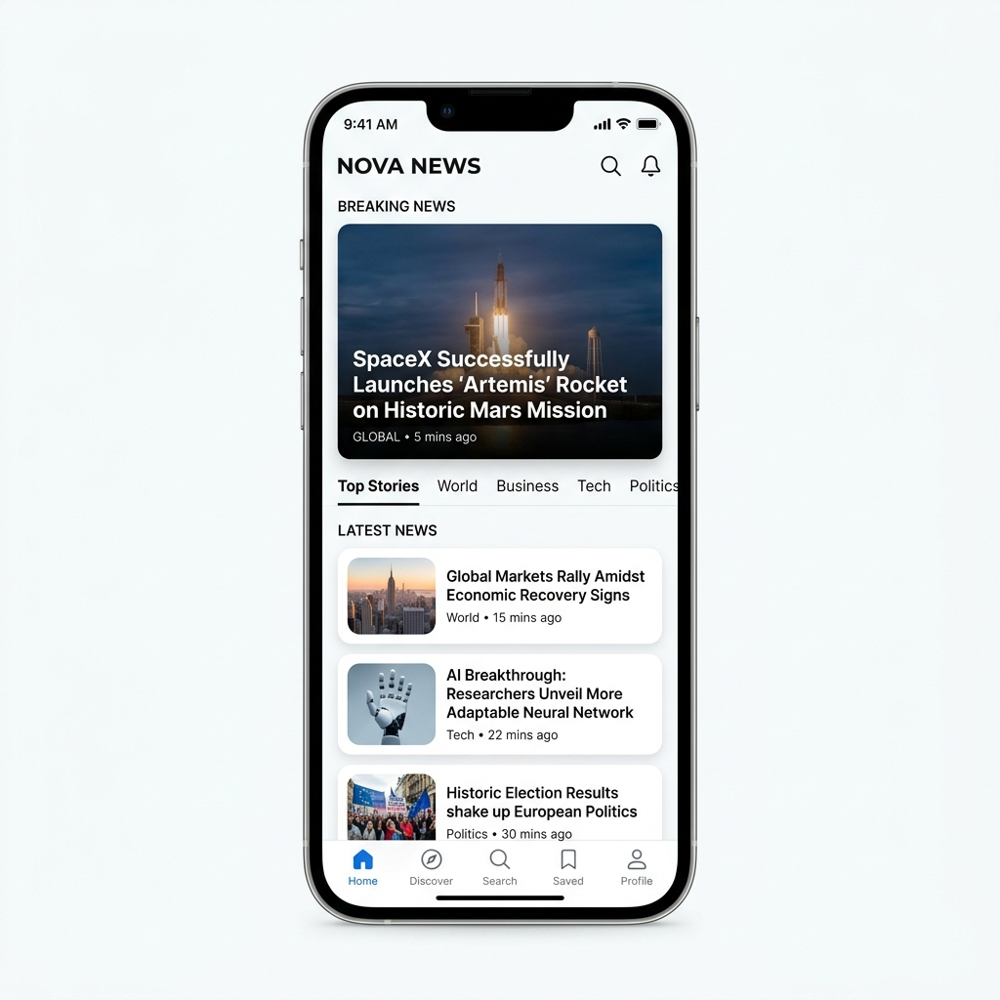
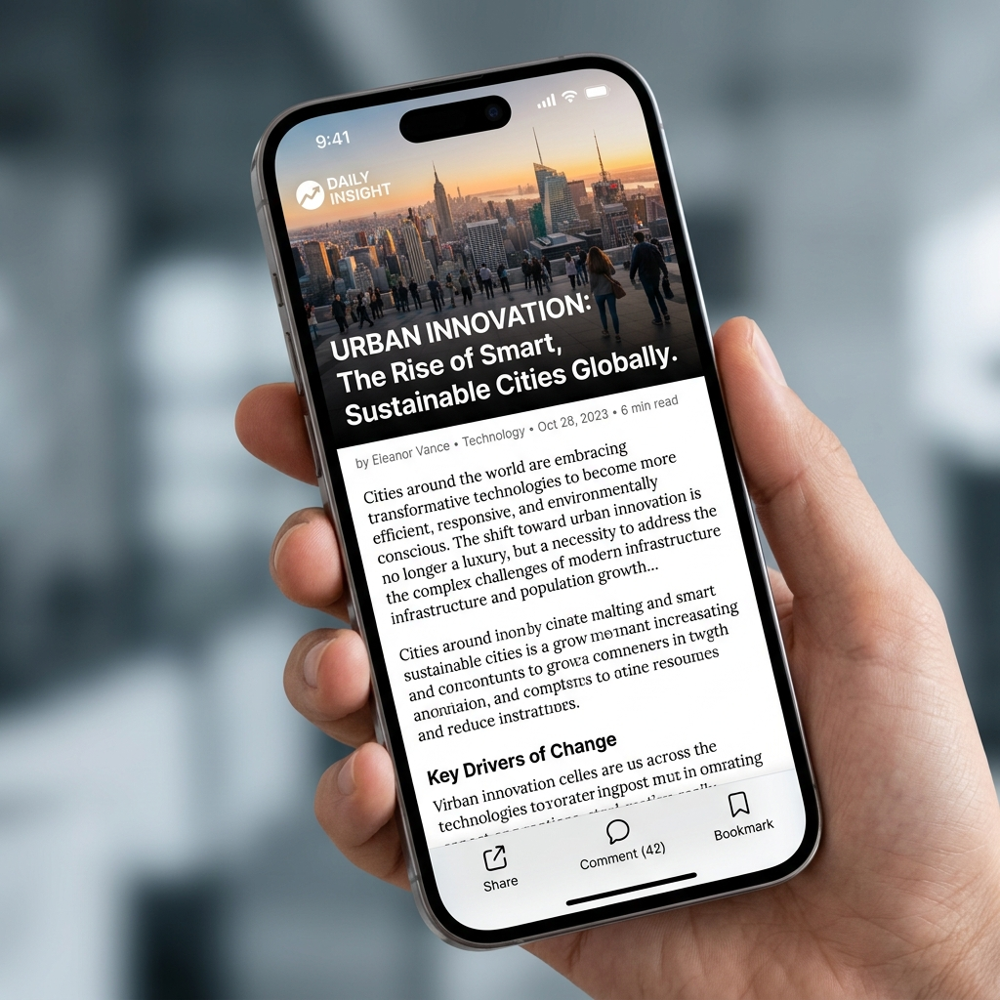

# 📱 모바일 뉴스 플랫폼 기획서 (NOVA NEWS)

> [!TIP]
> 본 저장소의 **범용 모바일 기획 스킬(`mobile-web-planner`)**을 바탕으로, 요구사항에 맞춰 뉴스 도메인에 최적화된 기획서 및 UI 목업을 작성한 예시(Example)입니다.

## 1. 서비스 개요
- **서비스명**: NOVA NEWS (가칭)
- **서비스 핵심 가치**: 바쁜 현대인을 위해 글로벌 핵심 이슈와 트렌드를 빠르고 직관적으로 전달하는 미니멀리즘 뉴스 플랫폼.
- **주요 타겟**: 20~40대 직장인 및 시사/경제 이슈에 관심이 많은 모바일 사용자.

## 2. 정보 구조도 (IA)
- **Home (메인 홈)**
  - Breaking News (속보 하이라이트)
  - Top Stories (주요 카테고리별 피드)
- **Discover (탐색)**
  - 관심사 맞춤형 키워드 뉴스
- **Search (검색)**
  - 통합 검색 및 실시간 트렌드 키워드
- **Saved (스크랩)**
  - 북마크한 기사 모아보기 및 오프라인 읽기
- **Profile (마이페이지)**
  - 폰트 크기/테마 설정, 구독 관리

---

## 3. 화면별 기능 정의 및 UI 레이아웃

### [SCR-01] 메인 홈 (Home)
* **화면 목적**: 사용자가 앱을 켜자마자 가장 중요한 글로벌 속보를 시각적으로 확인하고, 카테고리별 뉴스를 직관적으로 탐색할 수 있는 진입점입니다.
* **UI 레이아웃**:
  * **[상단 GNB]**: 서비스 로고(NOVA NEWS), 검색 아이콘, 알림(종) 아이콘
  * **[속보 영역]**: 'BREAKING NEWS' 타이틀과 함께 대형 썸네일 이미지 및 헤드라인 배치
  * **[카테고리 탭]**: Top Stories, World, Business, Tech 등 좌우 스와이프가 가능한 탭
  * **[뉴스 피드 리스트]**: 라운드 처리된 카드 형태 리스트 (좌측 썸네일, 우측 타이틀/메타 정보)
  * **[하단 탭 바]**: Home, Discover, Search, Saved, Profile
* **기능 및 인터랙션 (Action)**:
  * 썸네일 또는 기사 카드 클릭 시 ➡️ **[SCR-02] 기사 상세 화면**으로 이동
  * 카테고리 탭 스와이프 시 ➡️ 해당 카테고리 피드로 부드러운 화면 전환(Swipe view) 발생

### [SCR-02] 기사 상세 (Article Detail)
* **화면 목적**: 기사 본문을 가독성 높게 제공하며, 사용자가 기사에 대한 의견을 남기거나 쉽게 공유/스크랩 할 수 있도록 지원합니다.
* **UI 레이아웃**:
  * **[헤더 이미지]**: 기사 최상단에 화면 폭을 꽉 채우는 고해상도 대표 이미지
  * **[기사 타이틀]**: 굵고 명확한 헤드라인 폰트 (예: URBAN INNOVATION)
  * **[메타 정보]**: 기자 이름, 카테고리, 발행일, 읽는 데 걸리는 예상 시간(예: 6 min read)
  * **[본문 영역]**: 눈이 편안한 줄 간격과 여백을 가진 텍스트 영역
  * **[하단 스티키 바(Sticky Bar)]**: 화면 하단에 항상 고정된 툴바 (공유, 댓글 갯수, 북마크 버튼 포함)
* **기능 및 인터랙션 (Action)**:
  * 화면 아래로 스크롤 시 ➡️ 상단 헤더 이미지가 자연스럽게 흐려지며 텍스트 가독성에 집중
  * 하단 'Share' 클릭 시 ➡️ OS 기본 공유 시스템 바텀 시트 호출
  * 하단 'Bookmark' 클릭 시 ➡️ 아이콘이 검게 채워지며 Saved 탭에 즉시 저장
* **예외 처리 및 상태 (States)**:
  * 오프라인 또는 네트워크 단절 시 ➡️ "오프라인 상태입니다. 저장된 기사만 읽을 수 있습니다." 스낵바 노출

